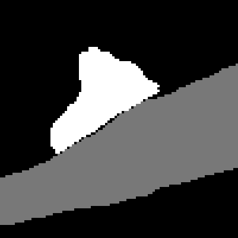
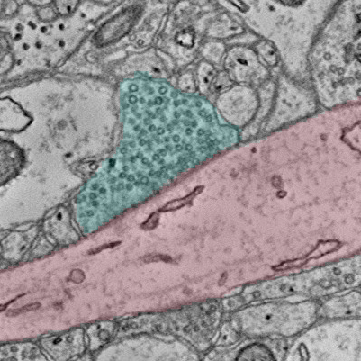
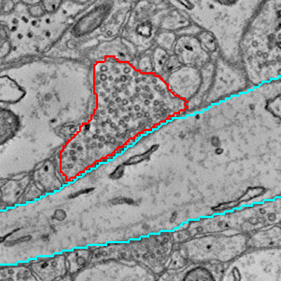

# ImageryClient

Connectomics data often involves a combination of microscopy imagery and segmentation, labels of distinct objects applied to this imagery.
While exploring the data in tools like [Neuroglancer](https://github.com/google/neuroglancer) is great, a common task is often to make figures overlaying 2d images and segmentation sliced from the larger data.
ImageryClient is designed to make it easy to generate aligned cutouts from imagery and segmentation, and make it efficient to produce attractive, publication-ready overlay images.

Because of the size of these volumes, cloud-based serverless n-d array file storage systems are often used to host this data.
[CloudVolume](https://github.com/seung-lab/cloud-volume/) has become an excellent general purpose tool for accessing such data.
However, imagery and segmentation for the same data are hosted at distinct cloud locations and can differ in basic properties like base resolution.
Moreover, imagery and segmentation have data that means intrensically different things.
Values in imagery indicate pixel intensity in order to produce a picture, while values in segmentation indicate the object id at a given location.
ImageryClient acts as a front end for making aligned cutouts from multiple cloudvolume sources, splitting segmentations into masks for each object, and more.

## How to use ImageryClient

Here, we will use the ImageryClient to get some data from the [Kasthuri et al. 2014 dataset](https://neuroglancer-demo.appspot.com/fafb.html#!gs://fafb-ffn1/main_ng.json) hosted by Google.
In its simplest form, we just intialize an ImageryClient object with an image cloudpath and a segmentation cloudpath.
Values are taken from the layers in the linked neuroglancer state.

```python
import imageryclient as ic

img_src = 'precomputed://gs://neuroglancer-public-data/kasthuri2011/image_color_corrected'
seg_src = 'precomputed://gs://neuroglancer-public-data/kasthuri2011/ground_truth'

img_client = ic.ImageryClient(image_source=img_src,
                              segmentation_source=seg_src)
```

### Bounds

We need bounds to make a cutout.
The imagery client takes bounds a pair of points: upper-left and lower-right.
Since often we are using analysis points to center an image on, `bounds_from_center` can help produce 2d or 3d bounds around a specified point.
Note that points are by default in voxel space for mip 0, thus correspond to values shown in Neuroglancer.

```python
ctr = [5319, 8677, 1201]
width = 200

bounds = ic.bounds_from_center(ctr, delx=width, dely=width)
```

### Imagery

We can download an image cutout from the bounds directly as an numpy array:

```python
image = img_client.image_cutout(bounds)

# Use PIL to visualize
from PIL import Image
Image.fromarray(image.T)
```


### Segmentations

An aligned segmentation cutout is retrieved similarly.
Note that segmentations show segment ids, and are not directly visualizable.
However, we can convert to a uint8 greyscale and see the gist, although there are many better approaches to coloring segmentations.

```python
seg = img_client.segmentation_cutout(bounds)

import numpy as np
Image.fromarray( (seg.T / np.max(seg) * 255).astype('uint8') )
```


Specific root ids can also be specified. All pixels outside those root ids have a value of 0.

```python
root_ids = [2282, 4845]
seg = img_client.segmentation_cutout(bounds, root_ids=root_ids)
Image.fromarray( (seg.T / np.max(seg) * 255).astype('uint8') )
```




### Split segmentations

It's often convenient to split out the segmentation for each root id as a distinct mask. These "split segmentations" come back as a dictionary with root id as key and binary mask as value.

```python
split_seg = img_client.split_segmentation_cutout(bounds, root_ids=root_ids)

Image.fromarray((split_seg[ root_ids[0] ].T * 255).astype('uint8'))
```


### Aligned cutouts

Aligned image and segmentations can be downloaded in one call, as well.
If the lowest mip data in each differs in resolution, the lower resolution data will be optionally upsampled to the higher resolution in order to produce aligned overlays.
Root ids and split segmentations can be optionally specified. This is the best option if your primary goal is overlay images.

```python
image, segs = img_client.image_and_segmentation_cutout(bounds,
                                                       split_segmentations=True,
                                                       root_ids=root_ids)
```

## Producing overlays

Now let produce an overlay of segmentation and imagery to highlight a particular synapse.
Overlays are returned as a [PIL Image](https://pillow.readthedocs.io/en/stable/), which has convenient saving options but can also be converted to RGBa via a simple `np.array` call.
Note that if imagery isn't specified, the segmentations are colored but not put over another image.
Segmentations must be either a list or a dict, such as comes out of split segmentation cutouts.

```python
ic.composite_overlay(segs, imagery=image)
```


### Aesthetic options

Colors are chosen by default from the perceptually uniform discrete [HUSL Palette](https://seaborn.pydata.org/generated/seaborn.husl_palette.html) as implemented in Seaborn, and any color scheme available through Seaborn's [color_palette](https://seaborn.pydata.org/generated/seaborn.color_palette.html?highlight=color_palette) function is similarly easy to specify.
Alpha is similarly easy to set.

```python
ic.composite_overlay(segs, imagery=image, palette='tab10', alpha=0.4)
```


Colors can also be specified in the same form as the segmentations, e.g. a dictionary of root id to RGB tuple.

```python
colors = {2282: (0,1,1), # cyan
          4845: (1,0,0)} # red
ic.composite_overlay(segs, imagery=image, colors=colors)
```


### Outline options

While the overlay guides the eye, it can also obscure the imagery.
Because of that, one can also use highly configurable outlines instead of solid overlays.
The default option puts the outlines along the outside of the segmentations, but omits lines where two segmentations touch.

```python
ic.composite_overlay(segs, imagery=image, outline=True, alpha=0.5, width=15, colors=colors)
```


Outlines can also be put inside of the segmentation and width can be specified.
Additionally, setting `merge_outline` to False will not omit outlines in places where segmentations touch.
Lots of different effects are possible!

```python
ic.composite_overlay(segs,
                     imagery=image,
                     outline=True,
                     alpha=1,
                     width=3,
                     merge_outline=False,
                     side='in',
                     colors=colors)
```



## 3d Image Stacks

All of the functions are designed to also work for 3d image stacks.
Image and segmentation cutouts will return 3d arrays instead of 2d ones.
However, note that composite images will come back as a list of PIL images.
An optional `dim` argument will perform the slicing on axes other than the z-axis, although anisotropy in voxel resolution will not be accounted for.

```python
ctr = [5019, 8677, 1211]
width = 100
z_slices = 3

bounds_3d = ic.bounds_from_center(ctr, delx=width, dely=width, delz=z_slices)

image, segs = img_client.image_and_segmentation_cutout(bounds_3d, split_segmentations=True)

overlays = ic.composite_overlay(segs, imagery=image, alpha=0.3, width=3,
                                merge_outline=False, side='in')

overlays[0]
```


In order to quickly assemble sequential images into a series, we can stack them.
A `direction` argument will let you specify `vertical` instead of the default, and spacing can be adjusted as well.

```python
ic.stack_images(overlays)
```


## Associated tools

While the ImageryClient was designed to work specifically with the [AnnotationFrameworkClient](https://github.com/seung-lab/AnnotationFrameworkClient)
and its associated suite of services, it should work with any cloudvolume project.

