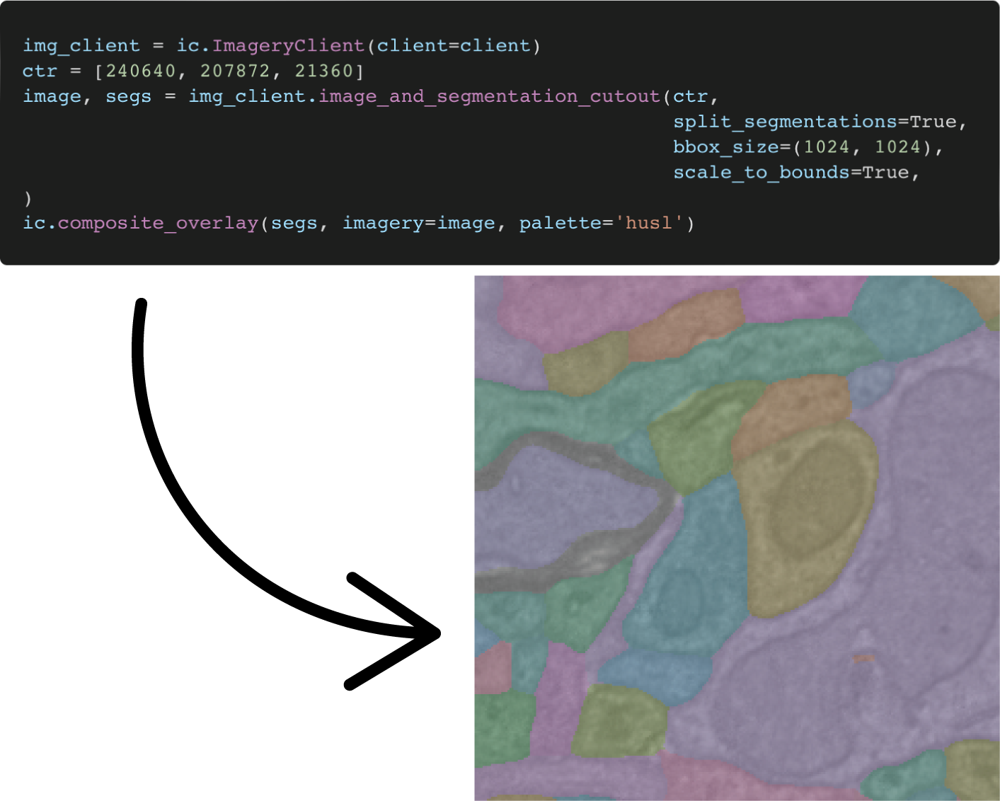

{: style="width:50%" align=left}
Connectomics data often involves a combination of microscopy imagery and segmentation, labels of distinct objects applied to this imagery.
While exploring the data in tools like [Neuroglancer](https://github.com/google/neuroglancer) is great, a common task is often to make figures overlaying 2d images and segmentation sliced from the larger data.
ImageryClient is designed to make it easy to generate aligned cutouts from imagery and segmentation, and make it efficient to produce attractive, publication-ready overlay images.

Because of the size of these volumes, cloud-based serverless n-d array file storage systems are often used to host this data.
[CloudVolume](https://github.com/seung-lab/cloud-volume/) has become an excellent general purpose tool for accessing such data.
However, imagery and segmentation for the same data are hosted at distinct cloud locations and can differ in basic properties like base resolution.
Moreover, imagery and segmentation have data that means intrensically different things.
Values in imagery indicate pixel intensity in order to produce a picture, while values in segmentation indicate the object id at a given location.
ImageryClient acts as a front end for making aligned cutouts from multiple cloudvolume sources, splitting segmentations into masks for each object, and more.

