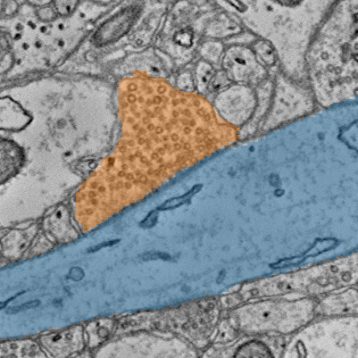
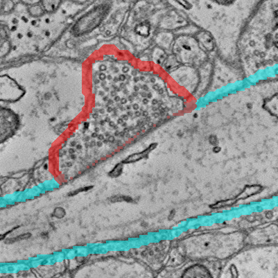
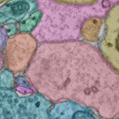

Once you have imagery and segmentation data, one important use case is to make visualizations overlaying segmentations on top of images.

Now let produce an overlay of segmentation and imagery to highlight a particular synapse.
Overlays are returned as a [PIL Image](https://pillow.readthedocs.io/en/stable/), which has convenient saving options but can also be converted to RGBa (a is for "alpha", i.e. transparency) via a simple `np.array` call.
Note that if imagery isn't specified, the segmentations are colored but not put over another image.
Segmentations must be either a list or a dict, such as comes out of split segmentation cutouts.

```python
ic.composite_overlay(segs, imagery=image)
```


### Aesthetic options

Colors are chosen by default from the perceptually uniform discrete [HUSL Palette](https://seaborn.pydata.org/generated/seaborn.husl_palette.html) as implemented in Seaborn, and any color scheme available through Seaborn's [color_palette](https://seaborn.pydata.org/generated/seaborn.color_palette.html?highlight=color_palette) function is similarly easy to specify.
Alpha is similarly easy to set.

```python
ic.composite_overlay(segs, imagery=image, palette='tab10', alpha=0.4)
```



Colors can also be specified in the same form as the segmentations, e.g. a dictionary of root id to RGB tuple.

```python
colors = {2282: (0,1,1), # cyan
          4845: (1,0,0)} # red
ic.composite_overlay(segs, imagery=image, colors=colors)
```


### Outline options

While the overlay guides the eye, it can also obscure the imagery.
Because of that, one can also use highly configurable outlines instead of solid overlays.
The default option puts the outlines along the outside of the segmentations, but omits lines where two segmentations touch.

```python
ic.composite_overlay(segs, imagery=image, outline=True, alpha=0.5, width=15, colors=colors)
```



Outlines can also be put inside of the segmentation and width can be specified.
Additionally, setting `merge_outline` to False will not omit outlines in places where segmentations touch.
Lots of different effects are possible!

```python
ic.composite_overlay(segs,
                     imagery=image,
                     outline=True,
                     alpha=1,
                     width=3,
                     merge_outline=False,
                     side='in',
                     colors=colors)
```


## 3d Image Stacks

All of the functions are designed to also work for 3d image stacks.
Image and segmentation cutouts will return 3d arrays instead of 2d ones.
However, note that composite images will come back as a list of PIL images.
An optional `dim` argument will perform the slicing on axes other than the z-axis, although anisotropy in voxel resolution will not be accounted for.

```python
ctr = [5019, 8677, 1211]
width = 100
z_slices = 3

bounds_3d = ic.bounds_from_center(ctr, delx=width, dely=width, delz=z_slices)

image, segs = img_client.image_and_segmentation_cutout(bounds_3d, split_segmentations=True)

overlays = ic.composite_overlay(segs, imagery=image, alpha=0.3, width=3,
                                merge_outline=False, side='in')

overlays[0]
```



In order to quickly assemble sequential images into a series, we can stack them.
A `direction` argument will let you specify `vertical` instead of the default, and spacing can be adjusted as well.

```python
ic.stack_images(overlays)
```


